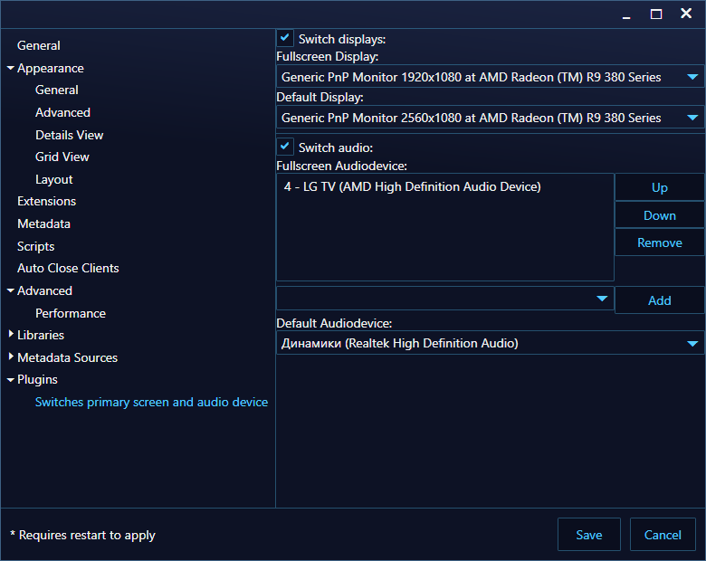

# Temporaly abandoned
With uncertaintly with the state of the Internet access in Russia in the future caused by invasion to Ukraine this project is abandoned until further notice. Feel free to fork.

# SwitchDisplay
A Playnite extension that switches primary display and audio output in a fullscreen mode

## Installation
------
### From .pext archive
Download [latest .pext release](https://github.com/konnogatto/SwitchDisplay/releases/latest), then drag and drop it onto Playnite window in a desktop mode
### Building from source
First, you need Visual Studio/Visual Studio Community with PlayniteSDK and NAudio packages installed. Then you can download [latest source release](https://github.com/konnogatto/SwitchDisplay/releases/latest) or clone this repository, open SwitchDisplay.sln, build and move files from bin/Release into %appdata%/Playnite/Extensions/SwitchDisplay

### Help with localization

[https://crowdin.com/project/switchdisplay](https://crowdin.com/project/switchdisplay)